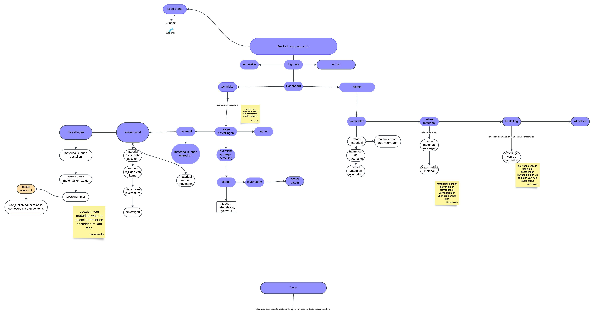
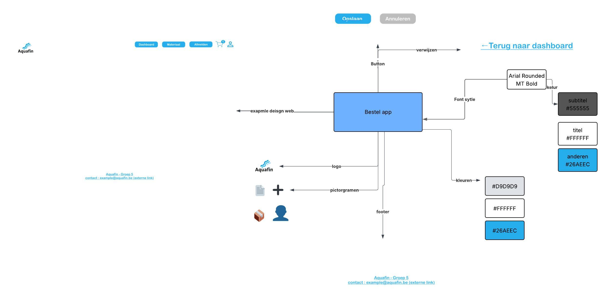
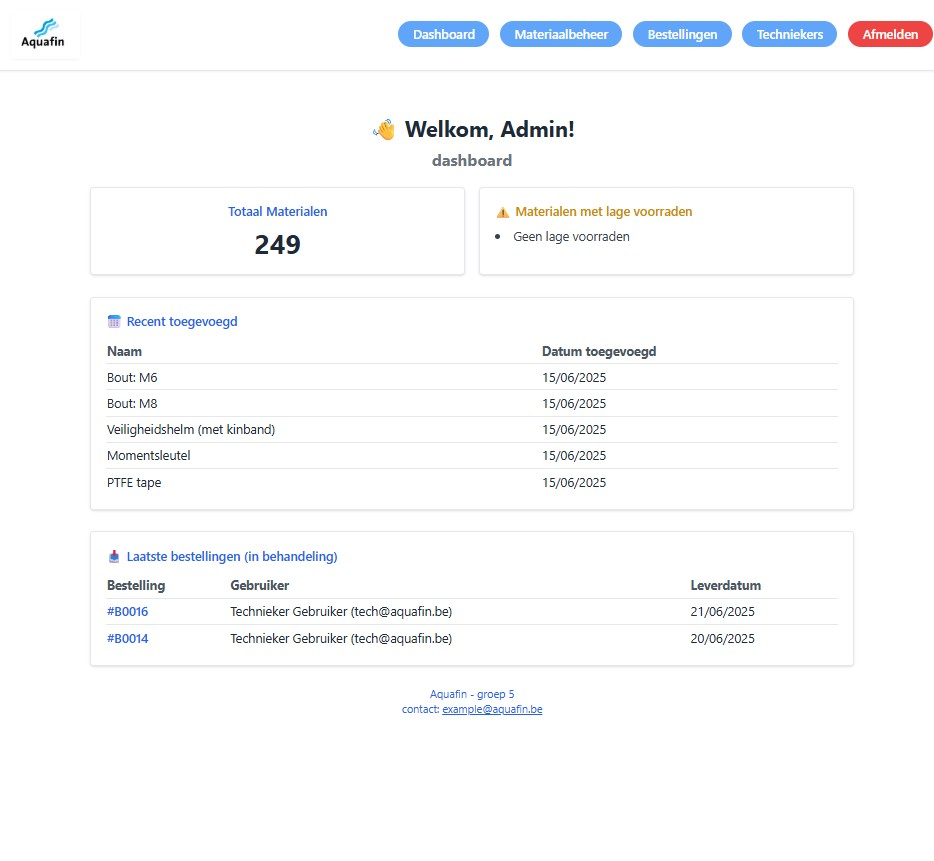
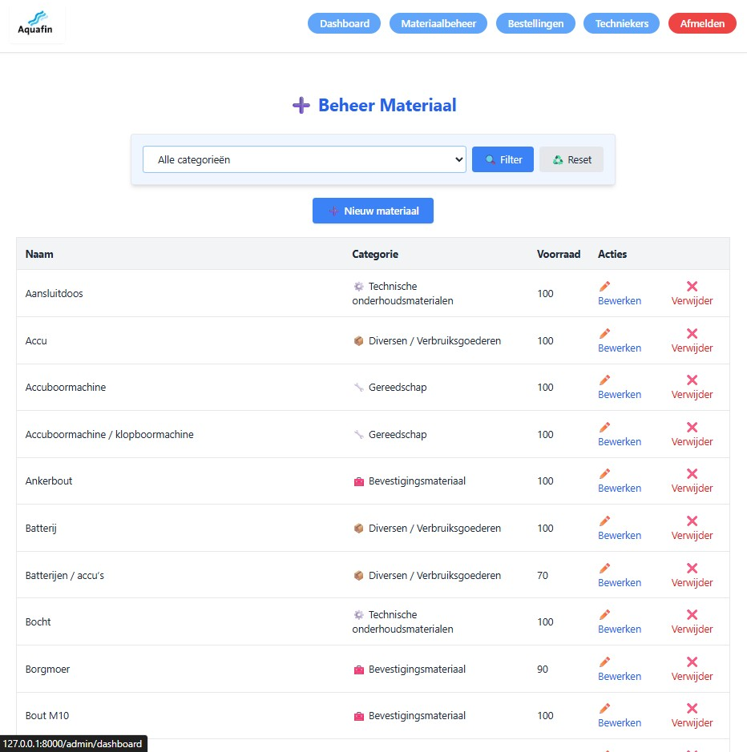
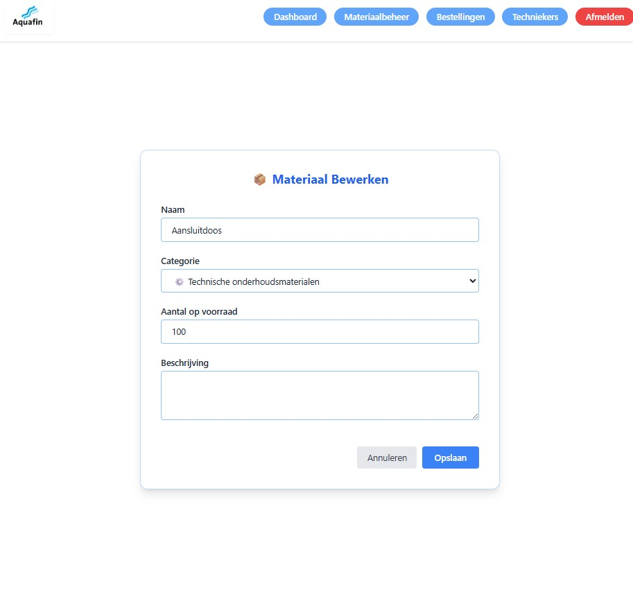
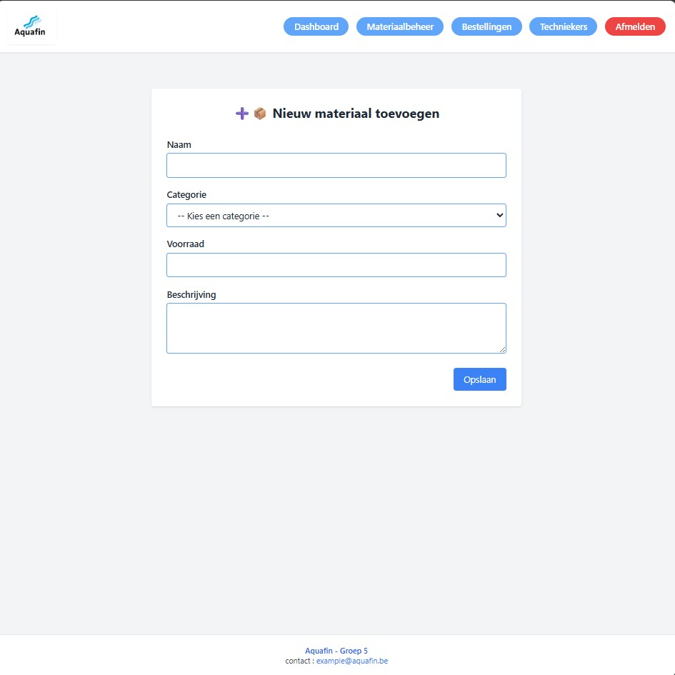
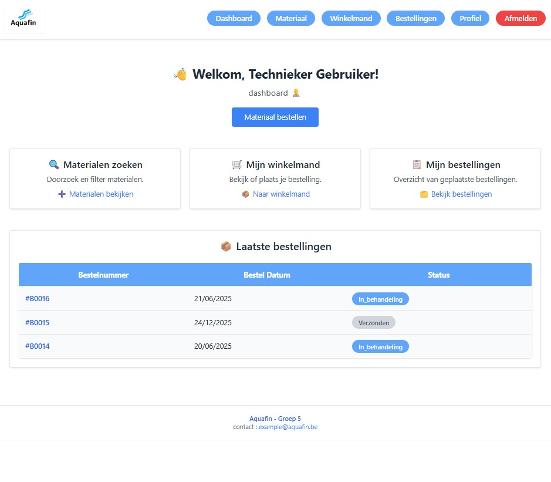
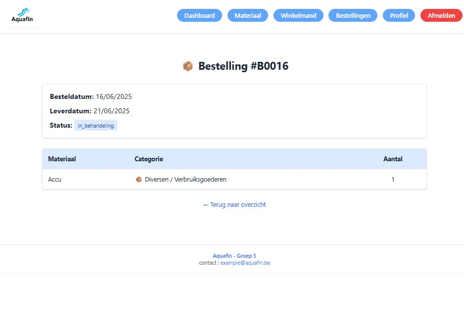
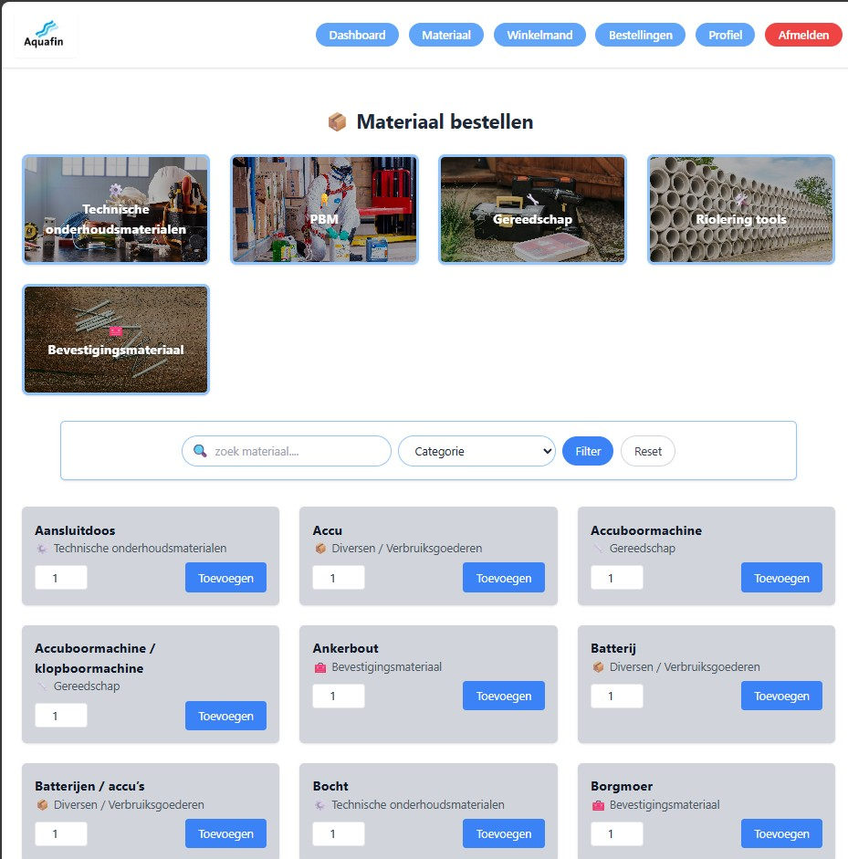
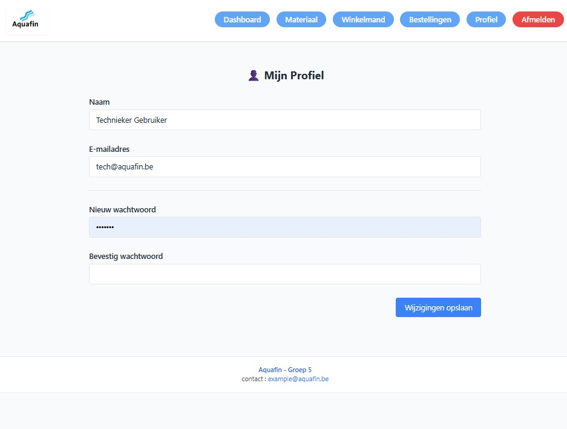

# 🛒 BestelApp – Materiaalbeheer voor Techniekers (Aquafin)

Een Laravel-webapplicatie waarmee techniekers van Aquafin materiaal kunnen raadplegen, bestellen en opvolgen. Admins beheren het aanbod en gebruikers. Alles is beveiligd, getest en gestructureerd met duidelijke documentatie en design.

🔗 **Repository**: [https://github.com/kiranchaudry97/groep5.project.bestelapp](https://github.com/kiranchaudry97/groep5.project.bestelapp)

---

## 📁 Mappenstructuur

```text
groep5.project.bestelapp/
├── app/                  # Controllers, Models
├── resources/            # Blade views, CSS, JS
├── routes/               # web.php, api.php
├── database/             # Migraties, seeders
├── public/               # Publieke toegang, index.php
├── config/               # Laravel-configuratie
├── tests/                # PHPUnit tests
├── package.json          # Frontend dependencies
├── vite.config.js        # Vite configuratie
└── .env                  # Omgevingsinstellingen
```

---

## 📦 `package.json` uitleg

- `vite`: compileert assets
- `tailwindcss`: zorgt voor styling
- `laravel-vite-plugin`: koppelt dit aan Laravel views

---

## 📌 Projectdoel

Techniekers van Aquafin moeten dagelijks kunnen rekenen op materiaal. Deze app laat hen bestellingen plaatsen met leverdatum. Admins beheren materialen, voorraden en rollen.

---

## ✅ Functionaliteiten

- Gebruikersregistratie en login
- Materiaal raadplegen en bestellen
- Leverdatum instellen
- Rollen en rechten beheren
- Admin- en gebruikersdashboards

---

## 🧭 Flowchart van de applicatie

📷 *Functioneel overzicht van de gebruikersstroom:*



---

## 🎨 Moodboard & Designstijl

📷 *UI-kleuren, lettertypes, knoppen, pictogrammen*



---

## 🖼️ Screenshots van de applicatie

### 👤 Admin Login & Dashboard


### 🛠️ Materiaalbeheer


### ✏️ Materiaal Bewerken


### ➕ Materiaal Toevoegen


### 👷 Technieker Dashboard


### 🛒 Besteloverzicht (technieker)


### 📦 Materiaal Selectie & Filtering


### 👤 Profielpagina


---

## 🧪 Prototypeschermen

📷 *Volledig klikbare mockups*


---

## ⚙️ Installatie

```bash
composer install
cp .env.example .env
php artisan key:generate
php artisan migrate --seed
php artisan serve
```

### Frontend (Vite)
```bash
npm install
npm run dev
```

---

## 🗃️ Database & ERD

📷 *ERD-datamodel: gebruikers, rollen, materialen, bestellingen*


Relaties:
- `gebruikers` ↔ `bestellingen`
- `bestellingen` ↔ `bestelregels` ↔ `materialen`
- `gebruikers` ↔ `rollen` ↔ `rechten`

---

## 🧪 Testen

```bash
php artisan test
```

- Bestelling plaatsen
- Validatiecontrole
- Rechtenbeheer

---

## 🔒 Beveiliging

- CSRF-beveiliging op formulieren
- Validatie via Form Requests
- Rollen- en rechtenbeheer via middleware
- Bcrypt hashing voor wachtwoorden

---

## 🧠 Codevoorbeeld – Bestelling plaatsen

```php
public function store(Request $request) {
  $data = $request->validate([
    'leverdatum' => 'required|date',
    'items' => 'required|array'
  ]);
  $bestelling = Bestelling::create([
    'gebruiker_id' => auth()->id(),
    'leverdatum' => $data['leverdatum'],
  ]);
  foreach ($data['items'] as $item) {
    Bestelregel::create([
      'bestelling_id' => $bestelling->id,
      'materiaal_id' => $item['materiaal_id'],
      'hoeveelheid' => $item['aantal'],
      'prijs' => $item['prijs']
    ]);
  }
  return redirect()->route('bestellingen.index');
}
```

---

## 👥 Team

Graduaat Programmeren : Kiran Chaud-ry , Elion Rexhepi, Ellis Damian Viracocha, Yazid-El-Yazghi


---

## 📅 Roadmap / Trello

🔗 Voeg hier je Trello-link toe  
📷 Voeg een screenshot toe van het sprintbord

---

## 📄 Licentie

MIT – Vrij te gebruiken, aanpassen en delen met bronvermelding.
